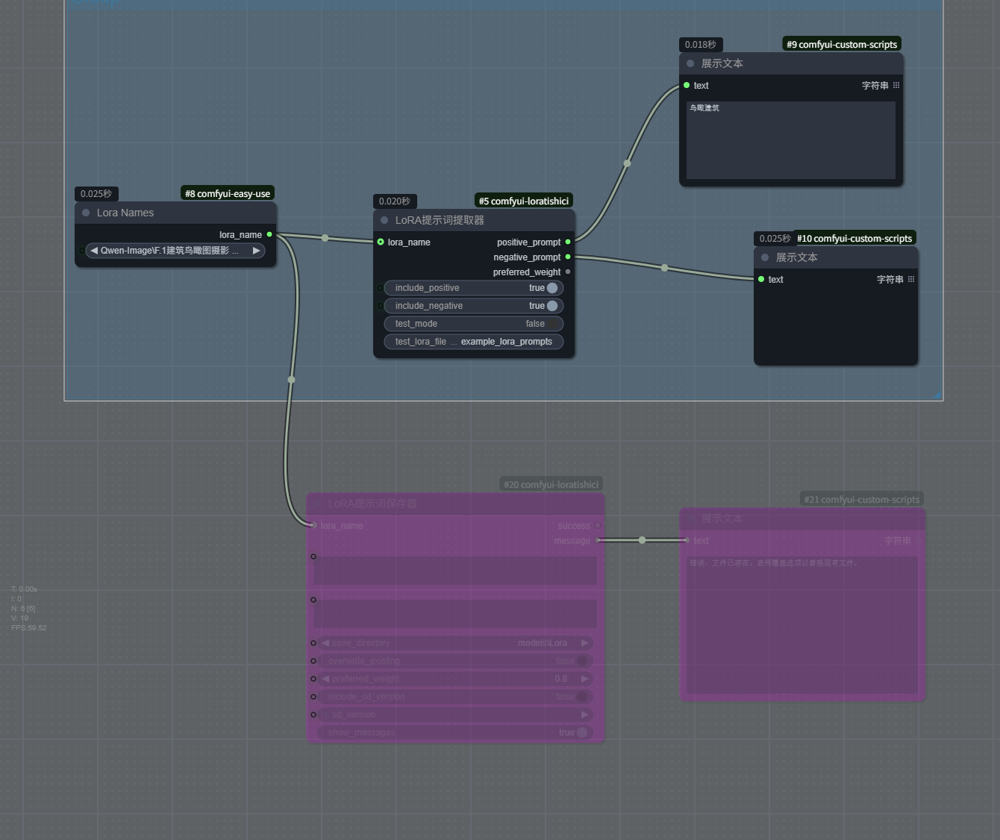

# ComfyUI LoRA提示词工具

<div align="center">
  <a href="https://github.com/username/comfyui-loratishici">
    
  </a>
  <a href="https://github.com/username/comfyui-loratishici">
    
  </a>
</div>

<div align="center">
  <strong>一个优雅的ComfyUI插件，让您轻松管理LoRA提示词</strong>
</div>

<br>

## 📝 项目简介

ComfyUI LoRA提示词工具提供两个强大的节点：**LoRA提示词提取器**和**LoRA提示词保存器**，实现类似WebUI的LoRA提示词管理功能，让您的创作流程更加顺畅。

## ✨ 核心功能

### LoRA提示词提取器

- 📖 从与LoRA同名的JSON文件中自动提取正向提示词、反向提示词和权重值
- 🎯 支持选择性地包含或排除正向/反向提示词
- 🔄 兼容多种JSON格式，支持"activation text"、"positive"、"prompt"等多种字段名
- 🧪 提供测试模式，无需连接LoRA加载器即可测试提示词提取功能
- 🔍 自动查找ComfyUI中配置的所有LoRA目录

### LoRA提示词保存器

- 💾 将正向提示词、反向提示词和权重值保存到与LoRA同名的JSON文件中
- 📁 支持选择保存到不同的LoRA目录
- 🔄 可选择是否覆盖已存在的文件
- 🔗 支持从LoRA加载器节点自动获取文件名
- 🏷️ 可选保存SD版本信息（1.5、SDXL、FLUX、QWEN等）
- 📂 自动创建不存在的目录，解决"No such file or directory"错误
- 💬 可控制是否显示成功/失败消息

## 🛠️ 节点参数详细说明

### LoRA提示词提取器节点参数

| 参数类别           | 参数名称               | 描述                                                             | 默认值                     |
| ------------------ | ---------------------- | ---------------------------------------------------------------- | -------------------------- |
| **输入参数** | `lora_name`          | 从LoRA加载器节点连接获取的LoRA文件名，或在测试模式下使用的文件名 | -                          |
|                    | `include_positive`   | 是否包含正向提示词                                               | `True`                   |
|                    | `include_negative`   | 是否包含反向提示词                                               | `True`                   |
|                    | `test_mode`          | 启用测试模式，无需连接LoRA加载器即可测试提示词提取               | `False`                  |
|                    | `test_lora_filename` | 测试模式下使用的文件名（不包含扩展名）                           | `"example_lora_prompts"` |
| **输出参数** | `positive_prompt`    | 提取的正向提示词，如果JSON中不存在则为空字符串                   | `""`                     |
|                    | `negative_prompt`    | 提取的反向提示词，如果JSON中不存在则为空字符串                   | `""`                     |
|                    | `preferred_weight`   | 提取的推荐权重值                                                 | `0.6`                    |

### LoRA提示词保存器节点参数

| 参数类别           | 参数名称               | 描述                                                  | 默认值                  |
| ------------------ | ---------------------- | ----------------------------------------------------- | ----------------------- |
| **输入参数** | `lora_name`          | 从LoRA加载器节点连接获取的LoRA文件名                  | -                       |
|                    | `positive_prompt`    | 要保存的正向提示词                                    | `""`                  |
|                    | `negative_prompt`    | 要保存的反向提示词                                    | `""`                  |
|                    | `weight`             | 要保存的权重值                                        | `0.6`                 |
|                    | `include_sd_version` | 是否包含SD版本信息                                    | `False怎么更新readme` |
|                    | `sd_version`         | 当include_sd_version为True时，选择SD版本              | `""`                  |
|                    | `save_directory`     | 选择保存JSON文件的目录，仅显示ComfyUI中配置的LoRA目录 | -                       |
|                    | `overwrite`          | 是否覆盖已存在的JSON文件                              | `True`                |
|                    | `show_messages`      | 是否显示成功/失败消息                                 | `True`                |
| **输出参数** | `success`            | 操作是否成功                                          | -                       |
|                    | `message`            | 成功或失败的详细信息（当show_messages为True时显示）   | -                       |

## 🚀 安装方法

1. 下载或克隆本仓库
2. 将文件夹复制到ComfyUI的 `custom_nodes`目录下
3. 重启ComfyUI

```bash
# 克隆仓库示例
cd /path/to/ComfyUI/custom_nodes
git clone https://github.com/username/comfyui-loratishici.git
```

## 🔍 关于LoRA路径查找

**重要说明**：插件通过ComfyUI的标准API（`folder_paths.get_folder_paths("loras")`）自动获取所有配置的LoRA目录，无需手动指定路径。无论您的ComfyUI安装在哪里，或者使用了什么自定义路径，插件都能准确找到正确的LoRA文件夹位置。

## 📖 使用方法

### LoRA提示词提取器

1. **准备JSON文件**：在LoRA文件所在的目录中，为每个需要提取提示词的LoRA创建一个同名的JSON文件

   - 例如：`example_lora.json` 对应 `example_lora.safetensors`
2. **JSON文件格式示例**：

```json
{
  "activation text": "masterpiece, best quality, 1girl",
  "negative text": "bad anatomy, bad hands",
  "preferred weight": 0.6
}
```

3. **在ComfyUI工作流中使用**：

   - 添加"LoRA提示词提取器"节点
   - 连接LoRA加载器的 `lora_name`输出到提取器的 `lora_name`输入
   - 连接提取器的输出到文本编码器或提示词输入节点
4. **测试模式**：无需连接LoRA加载器，直接设置 `test_mode`为True并指定测试文件名即可测试

### LoRA提示词保存器

1. **在ComfyUI工作流中使用**：

   - 添加"LoRA提示词保存器"节点
   - 连接LoRA加载器的 `lora_name`输出到保存器的 `lora_name`输入
   - 输入要保存的正向/反向提示词和权重值
   - 选择保存目录（仅显示配置的LoRA目录，默认选择原始LoRA文件所在目录）
   - 执行节点，提示词将保存为同名JSON文件
2. **自动功能**：

   - 支持自动创建不存在的目录（解决"No such file or directory"错误）
   - 可选择是否覆盖已存在的文件
   - 可选择是否显示成功/失败消息

## 🔧 如何确认工具是否工作

- **查看节点输出**：保存器有 `success`和 `message`输出端口，可连接到文本显示节点查看结果
- **查看控制台日志**：插件会输出详细的操作日志，包括文件路径和操作状态
- **手动验证**：直接前往保存目录检查是否成功创建了JSON文件

## 🖼️ 工作流示例

以下是完整的工作流示例，展示了LoRA提示词提取器和保存器的使用方法：

<div align="center">
  
</div>

**工作流说明**：
- 上方部分展示了通过LoRA Names节点连接到LoRA提示词提取器，并将提取的提示词输出到文本显示节点
- 下方部分展示了将LoRA提示词保存器与其他节点连接，实现提示词的保存功能

## ⚠️ 注意事项

- JSON文件必须与LoRA文件同名
- 插件支持 `.safetensors`和 `.pt`格式的LoRA文件
- 兼容多种JSON格式，支持"activation text"、"positive"、"prompt"等字段名
- 自动在所有配置的LoRA目录中查找JSON文件
- 自动创建不存在的目录，无需手动创建文件夹结构
- **保存器会自动将JSON文件保存在原始LoRA文件所在的目录**，确保文件保存在正确位置

## 🔍 故障排除

- 检查JSON文件格式是否正确
- 确认ComfyUI有文件读写权限
- 查看控制台输出获取详细错误信息
- 测试模式下确保测试文件存在于插件目录

## 🤝 贡献

欢迎提交Issue或Pull Request来帮助改进这个项目！

## 📄 许可证

此项目采用MIT许可证 - 详见[LICENSE](LICENSE)文件
